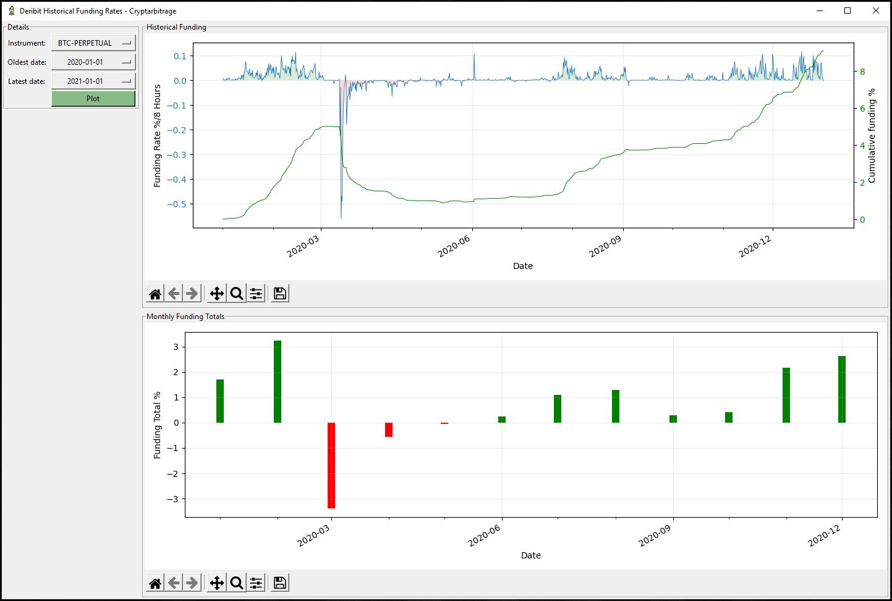

# Deribit Position Greeks
Python code that pulls in and displays historical funding data for the perpetual contracts on Deribit.
Be sure to edit the settings.py to the production site once you're ready to look at production data.
The testnet data is not the same at all.

The top chart shows the 8 hour funding rates, as well as the cumulative funding over that time period.
The second chart shows the monthly funding totals.

Go to https://github.com/cryptarbitrage-code/deribit-perpetual-funding for the latest code.

Follow me on https://twitter.com/cryptarbitrage for other free resources and content.

Deribit ref-link: https://www.deribit.com/?reg=1332.557&q=home (10% discount on trading fees)

## GUI and Charts
Tkinter is used for the GUI, and Matplotlib is used to plot the charts.

## Deribit API enpoints
This program uses the following api endpoints:

get_funding_rate_history 