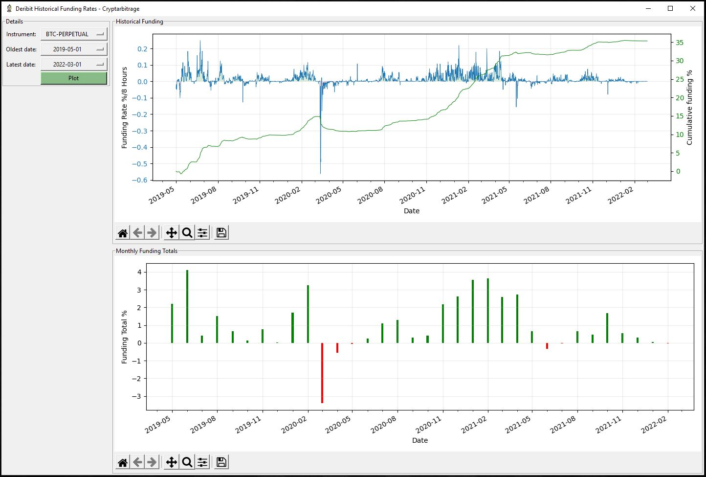

# Deribit Position Greeks
Python code that pulls in and displays historical funding data for the perpetual contracts on Deribit.

Go to https://github.com/cryptarbitrage-code/deribit-perpetual-funding for the latest code.

Follow me on https://twitter.com/cryptarbitrage for other free resources and content.

Deribit ref-link: https://www.deribit.com/?reg=1332.557&q=home (10% discount on trading fees)

## GUI and Charts
Tkinter is used for the GUI, and Matplotlib is used to plot the charts.

## Deribit API enpoints
This program uses the following api endpoints:

get_funding_rate_history 